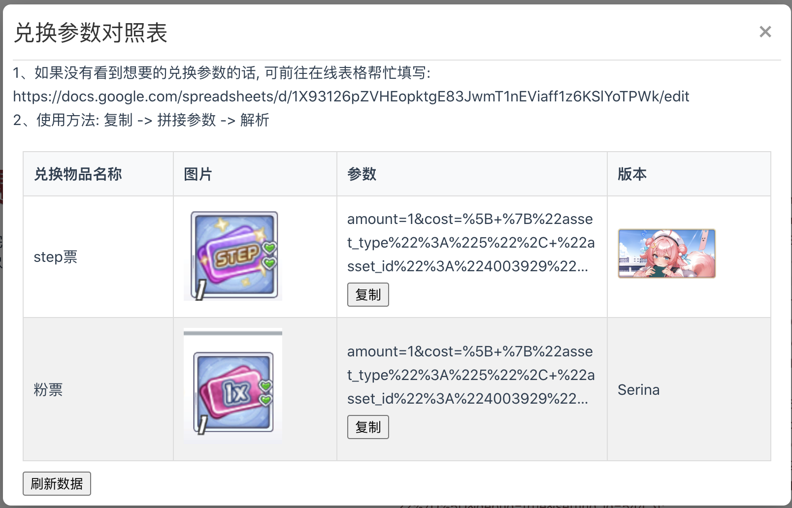

# pqt-tools

吉赛尔的工具箱，用于帮助完成QT相关数据处理的小工具集合，薅羊毛的好帮手。

## 更新日志

### 202510

#### 1、更新Google Sheet的图片形式

改为外部链接，否则需要授权，且oauth客户端较难审核（后发现与管理了GCP有关，如果不关联的话，不会强制要求审核，不过改都改了，无所谓吧）

### 202509

#### 1、新增了fetch的解析方式

该方式可以直接在网页上运行

#### 2、新增了参数对照表

可从表中选取兑换物品的参数，若物品不存在，则可前往指示的在线表格填写数据，供后人使用；技术栈为Apps Script和谷歌套装(Google Drive、Google Sheet、Google Cloud等)

#### 3、适配了除活动商店以外的兑换场景

如金币商店，可兑换体力药水；

